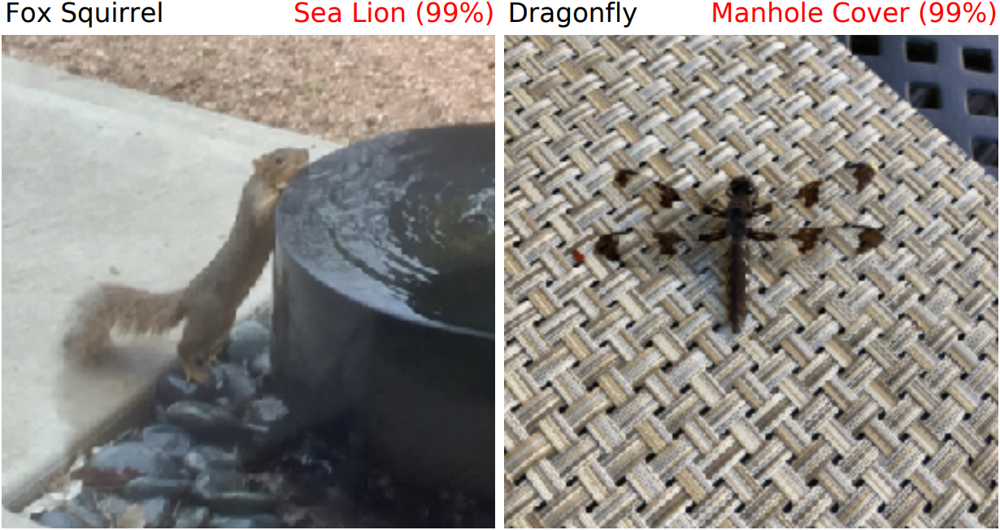

# Natural Adversarial Examples

We introduce natural adversarial examples -- real-world, unmodified, and naturally occurring examples that cause classifier accuracy to significantly degrade. Download the natural adversarial example dataset ImageNet-A [here](https://people.eecs.berkeley.edu/~hendrycks/imagenet-a.tar).

Some natural adverarial examples are shown in the following figure with the correct class, predicted class, and confidence:

## Citation

If you find this useful in your research, please consider citing:

    @article{hendrycks2019nae,
      title={Natural Adversarial Examples},
      author={Dan Hendrycks and Kevin Zhao and Steven Basart and Jacob Steinhardt and Dawn Song},
      journal={arXiv preprint},
      year={2019}
    }
